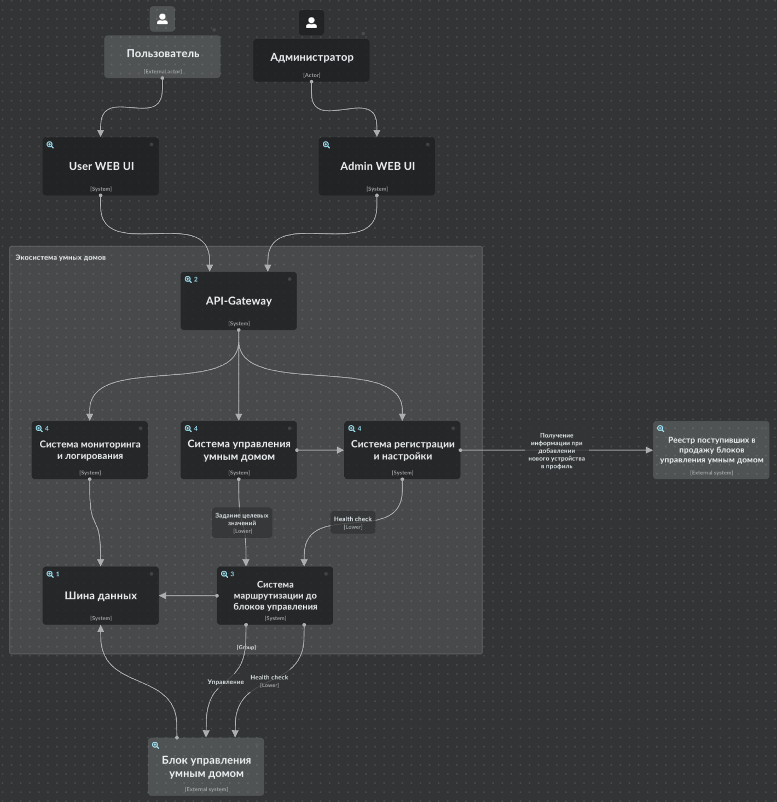
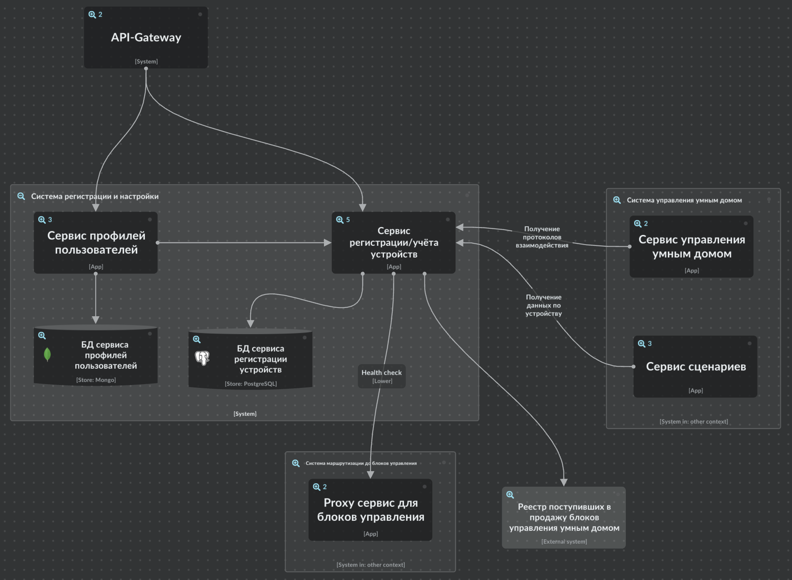
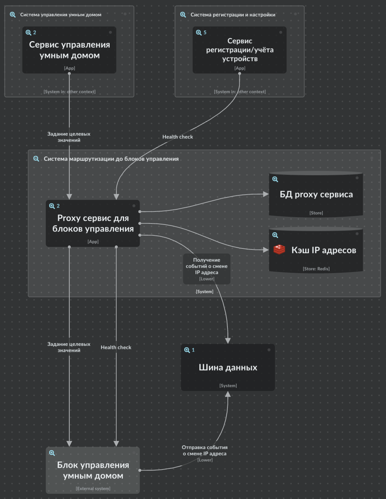

# Smart Home

## Описание

Проект "Smart Home" представляет собой монолитное приложение для управления отоплением и мониторинга температуры в умном доме. Пользователи
могут удаленно включать/выключать отопление, устанавливать желаемую температуру и просматривать текущую температуру через веб-интерфейс.

## 1.1 Архитектура AsIs

### 1.1.1 Функциональность приложения:

#### Управление отоплением:
1. Пользователи могут удалённо включать/выключать отопление в своих домах.
2. Пользователи могут устанавливать желаемую температуру.
3. Система автоматически поддерживает заданную температуру, регулируя подачу тепла.
#### Мониторинг температуры:
1. Система получает данные о температуре с датчиков, установленных в домах.
2. Пользователи могут просматривать текущую температуру в своих домах через веб-интерфейс.

### 1.1.2 Архитектура приложения:
- Язык программирования: Java
- База данных: PostgreSQL
- Архитектура: Монолитная, все компоненты системы (обработка запросов, бизнес-логика, работа с данными) находятся в рамках одного приложения.
- Взаимодействие: Синхронное, запросы обрабатываются последовательно.
- Масштабируемость: Ограничена, так как монолит сложно масштабировать по частям.
- Развертывание: Требует остановки всего приложения.

### 1.1.3 Домены и границы контекстов

- Домен "Мониторинга и управления устройствами отопления"
  - поддомен мониторинга
    - контекст: получение текущих значений температуры и целевых значений температуры
    - контекст: вывод полученных значений в UI пользователя
  - поддомен управления
    - контекст: задание целевых значений температуры
- Домен "Устройства отоплений"
  - контекст: физические устройства с API для взаимодейстия с ними

### 4. C4 System Context diagram


## 1.2 Архитектура ToBe

### 1.2.1 Декомпозиция на микросервисы

- Сервис реестра поступивших в продажу блоков управления (коробки). 
  - Данный сервис хранит и предоставляет информацию по поступившим в продажу блоков управления (коробки).
  - Пользователь покупает нашу коробку, далее заходит в свой профиль и добавляет к себе в профиль нашу коробку, используя название коробки и код доступа для неё. Далее он может поменять код доступа коробки, поменять название коробки.
  - С помощью данного сервиса мы контролируем то, что пользователи к своему профилю могут привязать только официально проданные коробки.
  - БД: Postgres.
- Сервис пользовательских профилей. 
  - Хранит и предоставляет доступ к профилю пользователя. 
  - Взаимодействует с сервисом реестра поступивших в продажу коробок, чтобы пользователь мог привязать к своему профилю купленную коробку.
  - Взаимодействует с сервисом регистрации устройств, чтобы получить список коробок и подключённых к ним устройствам, которые подключены у пользователя.
  - БД: Mongo. Т.к. информация, которую можно будет задать в профиле пользователя, скорей всего будет расширяться.
- Сервис регистрации устройств
  - Хранит и предоставляет информацию по добавленным в профиль пользователя коробками и по добавленным к ним устройствам.
  - Хранит и предоставляет данные по поддерживаемым устройствам.
  - Хранит информацию по протоколам взаимодействия с умными устройствами.
  - БД: Postgres.
- Сервис управления умным домом
  - Сервис, который используется для взаимодействием с умными устройствами через коробку.
  - Взаимодействует с сервисом регистрации устройств, для получения протокола взаимодействия с умными устройствами. Передаёт данную информацию в коробку вместе с параметрами управления (целевое значение, которое нужно установить).
  - БД: нет.
- Сервис телеметрии
  - Предоставляет информацию по мониторингу, взаимодействует с сервисом телеметрии для получения данной информации (текущее значение и историю изменения текущего значения)
  - Хранит информацию по изменению текущих значений умных устройств.
  - Может вернуть последнее значение и историю изменений.
  - БД: Clickhouse. TS БД лучше всего подходит для хранения временных рядов, что из себя и представляют метрики изменения текущего значения умного устройства.
- Сервис сценариев
  - Позволяет пользователям задавать сценарии для умных устройств.
  - Может обрабатывать данные сценарии и ставить в оцередь отложенные задания для выполнения через сервис управления умным домом.
  - Опрашивает сервис регистрации устройств, чтобы проверить, что коробка и умное устройство подключено.
  - БД: Postgres.
- Сервис логирования операций
  - Сохраняет логи действий пользователей, администратора, автоматических джоб.
  - БД: Postgres.
- Proxy IP адресов для домов/блоков
  - Хранит информацию по внешним IP адресам приобретённых коробок.
  - Также выступает как Proxy для взаимодействия с установленными в доме коробками.
  - БД: Postgres.

#### 1.2.1.1 Общая схема микросервисной системы [drawio](ToBe.drawio):


### 1.2.2 Определение взаимодействия

- API-Gateway - пользователи взаимодействуют с нашими микросервисами через API-Gateway Kongo, данный инструмент выполняет функции Reverse Proxy, авторизации (OAuth2 и JWT), и роутинга маршруторв. Также будет поднят отдельный API-Gateway с простой авторизацией Basic Auth для наших блоков управления (коробок), коробки будут ходить в него с токеном.
- Синхронное межсервисное взаимодействие - будем использовать gRPC как наиболее поддерживаемый открытый и доступный протокол
- Асинхронное взаимодействие - для него будем использовать Kafka. Через асинхронное взаимодействие блок управления будет отсылать сообщения о новых текущих значениях умных устройств и об изменении их целевых значений с информацией о том, кто выполнил данное изменение: пользователь, администратор, автоматическое изменение по сценарию. Данные сообщения будет обрабатывать сервис телеметрии для сохраннения текущих значений и сервис логирования действий для сохранения целевых значений и того, кто их изменил
- БД - в основном будет использоваться Postgres, для специфичных вещей будут использоваться специализированные БД. Для сохранения телеметрии будем использовать Clickhouse, для хранения профилей пользователей Mongo.

### 1.2.3 Визуализация архитектуры

#### Лучше смотреть в [icepanel](https://s.icepanel.io/WFXJZm3LIyohpS/ZAV9)

#### C4 System Context diagram 


#### C4 Containers diagram

##### API-Gateway


##### Система мониторинга и логирования


##### Система управления умным домом


##### Система регистрации и настройки 



##### Система маршрутизации до блоков управления



##### Шина данных


#### C4 Components diagram


## 1.3 ER-диаграмма

### 1.3.1 Идентификация сущностей

- Пользователь (User)
- Дом (House)
- Блок управления (Module)
- Устройство (Device)
- Тип устройства (DeviceType)
- Протокол взаимодействия с устройством (DeviceProtocol)
- Целевое значение устройства (DeviceTargetValue)
- Телеметрия текущих значений (TelemetryData)
- История изменений целевых значений/статуса (TargetValueHistory)

### 1.3.2 Определение атрибутов

- Сущность "Пользователь" (User):
  - id - уникальный идентификатор
  - login - логин пользователя
  - password - хэш пароля
  - email - адрес почтового ящика
  - phone - телефон пользователя

- Сущность "Дом" (House):
  - id - уникальный идентификатор
  - name - название дома
  - user_id - идентификатор пользователя, которому принадлежит дом - внешний ключ к таблице Users

- Сущность "Блок управления" (Module):
  - id - уникальный идентификатор
  - name - название блока
  - key - ключ доступа
  - status - статус блока управления (вкл/выкл) - Enum
  - user_id - идентификатор пользователя, которому принадлежи блок - внешний ключ к таблице Users
  - house_id - идентификатор дома, в котором установлен блок - внешний ключ к таблице Houses

- Сущность "Устройство" (Device):
  - id - уникальный идетификатор
  - name - наименование устройства
  - serial_number — серийный номер устройства.
  - type_id — идентификатор типа устройства — внешний ключ к таблице DeviceTypes
  - status — текущее состояние устройства (включено/выключено) - Enum
  - module_id - идентификаторо блока управления, к которому подключено устройство - внешний ключ к таблице Modules

- Сущность "Тип устройства" (DeviceType):
  - id - уникальный идетификатор
  - type - описание типа устройства
  - protocol_id - идентификатор описания протокола взаимодействия - внешний ключ к таблице Protocols
  - target_value_id - идентификатор целевого значения устройства - внешний ключ к таблице DeviceTargetValue

- Сущность "Протокол взаимодействия с устройством" (DeviceProtocol):
  - id - уникальный идентификатор
  - how_to_on - как включить устройство
  - how_to_off - как выключить устройство
  - how_to_set_value - как установить целевое значение устройства
  - how_to_get_info - как опросить устройство

- Сущность "Целевое значение устройства" (DeviceTargetValue):
  - id - уникальный идентификатор
  - type - тип целевого значения
  - value - целевое значение
  - min - минимальное целевое значение
  - max - максимальное целевое значение

- Сущность "Телеметрия текущего значения" (TelemetryData)
  - id - уникальный идентификатор
  - device_id - идентификатор устройства - внешний ключ к таблице "Devices"
  - value - значение
  - occurance_at - когда устройство отдавало это значение

- Сущность "История изменений целевых значений/статуса" (TargetValueHistory)
  - id - уникальный идентификатор
  - device_id - идентификатор устройства - внешний ключ к таблице "Devices"
  - module_id - идентификаторо блока управления, к которому подключено устройство - внешний ключ к таблице Modules
  - actor - кто изменил целевое значение
  - value - значение
  - status - статус устройства
  - occurance_at - когда изменено целевое значение


### 1.3.3 Описание связей

- Пользователь — Дом (один-ко-многим): один пользователь может иметь доступ к нескольким домам, но каждый дом связан только с одним пользователем.
- Дом - Блок управления (один-ко-многим): в одном доме может быть установлено несколько блоков управления, но каждый блок связан только с одним домом.
- Блок управления — Устройство (один-ко-многим): к одному блоку управления может быть подключено несколько устройств, и каждое устройство принадлежит только одному блоку управления.
- Устройство — Телеметрия текущего значения (один-ко-многим): одно устройство может генерировать множество записей телеметрии.
- Устройство — История изменений целевых значений/статуса (один-ко-многим): одно устройство может множество раз менять своё целевое значение.
- Блок управления — История изменений целевых значений/статуса (один-ко-многим): один блок управления может множество раз менять своё состояние (вкл/выкл).
- Тип устройства - Устройство (один-ко-многим): один тип может быть привязан к разным устройствам (например, в доме установлено несколько выключателей света одного типа). Но одно устройство может иметь только один тип.
- Тип устройства - Целевое значение устройства (один-к-одному): один тип устройства характеризуется только одним целевым значением и наоборот
- Тип устройства - Протокол взаимодействия с устройством (один-к-одному): для одного типа устройства есть один протокол взаимодействия и наоборот

### 1.3.4 ER-диаграмма

ER-диаграмму я не стал бить по различным БД, а представил общие связи между объектами. 


## 1.4 Создание и документирование API


# Базовая настройка

## Запуск minikube

[Инструкция по установке](https://minikube.sigs.k8s.io/docs/start/)

```bash
minikube start
```


## Добавление токена авторизации GitHub

[Получение токена](https://github.com/settings/tokens/new)

```bash
kubectl create secret docker-registry ghcr --docker-server=https://ghcr.io --docker-username=<github_username> --docker-password=<github_token> -n default
```


## Установка API GW kusk

[Install Kusk CLI](https://docs.kusk.io/getting-started/install-kusk-cli)

```bash
kusk cluster install
```


## Настройка terraform

[Установите Terraform](https://yandex.cloud/ru/docs/tutorials/infrastructure-management/terraform-quickstart#install-terraform)


Создайте файл ~/.terraformrc

```hcl
provider_installation {
  network_mirror {
    url = "https://terraform-mirror.yandexcloud.net/"
    include = ["registry.terraform.io/*/*"]
  }
  direct {
    exclude = ["registry.terraform.io/*/*"]
  }
}
```

## Применяем terraform конфигурацию 

```bash
cd terraform
terraform apply
```

## Настройка API GW

```bash
kusk deploy -i api.yaml
```

## Проверяем работоспособность

```bash
kubectl port-forward svc/kusk-gateway-envoy-fleet -n kusk-system 8080:80
curl localhost:8080/hello
```


## Delete minikube

```bash
minikube delete
```
